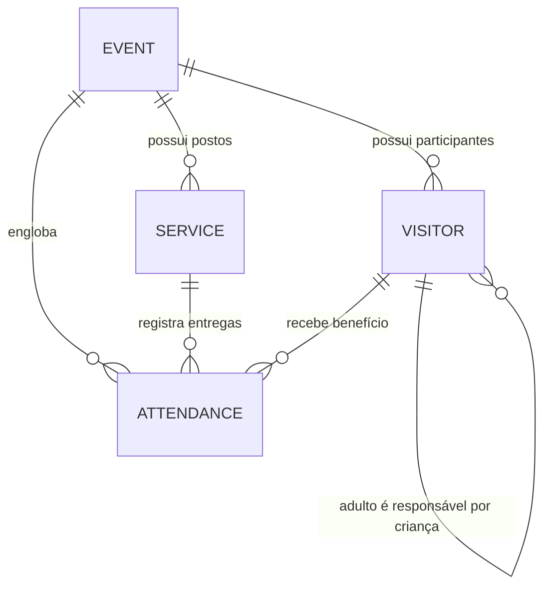

# Data Model — GiraFila

This file documents the data model and storage schema of **GiraFila** using browser-native **IndexedDB** (`gira_fila_db`).

---

## 1. Core Entities

### 1. `events` (Eventos)
Representa a ação social realizada pela instituição em determinada data e local.

| Field | Type | Description |
|---|---|---|
| `id` | Integer (autoIncrement) | Chave primária |
| `name` | String (até 50) | Nome do evento (capitalizado) |
| `date` | String (ISO-8601 UTC) | Data literal do evento |
| `location` | String | Endereço ou local da realização |
| `description` | String | Descrição informativa |
| `created_at` | String (ISO-8601 UTC) | Timestamp de criação |

### 2. `services` (Postos de Atendimento e Benefícios)
Representa as atividades e benefícios oferecidos durante um evento (ex: Cabeleireiro, Dentista, Brinquedos).

| Field | Type | Description |
|---|---|---|
| `id` | Integer (autoIncrement) | Chave primária |
| `name` | String | Nome da atividade/posto |
| `event_id` | Integer | ID do evento vinculado |
| `only_children`| Boolean | Restrição: exclusivo para crianças |
| `only_adults` | Boolean | Restrição: exclusivo para adultos |
| `attendant_name` | String (até 200) | Nome do voluntário/profissional encarregado |
| `description` | String (até 200) | Detalhes e instruções operacionais |
| `created_at` | String (ISO-8601 UTC) | Timestamp de criação |

### 3. `visitors` (Participantes e Visitantes)
Participantes cadastrados na recepção para um evento específico, vinculados ao número físico de ticket QR Code (1 a 9999).

| Field | Type | Description |
|---|---|---|
| `id` | Integer (autoIncrement) | Chave primária |
| `event_id` | Integer | ID do evento |
| `qr_code` | Integer (1–9999) | Número do ticket QR Code entregue |
| `name` | String (até 200) | Nome completo (auto-capitalizado) |
| `gender` | String | Gênero (`Masculino` ou `Feminino`) |
| `age` | Integer (0–120) | Idade em anos |
| `is_child` | Boolean | Indicador de menor de idade |
| `phone` | String (opcional) | Formato `(XX) XXXXX-XXXX` (apenas adultos) |
| `has_phone` | Boolean | Indica se possui telefone |
| `guardian_qr_code` | Integer (opcional) | QR Code do adulto responsável (obrigatório se `is_child = true`) |
| `created_at` | String (ISO-8601 UTC) | Timestamp de criação |

*Restrição de integridade:* Índice composto único `['event_id', 'qr_code']`. O mesmo QR Code não pode ser registrado para mais de um participante no mesmo evento.

### 4. `attendances` (Registros de Atendimento)
Registra o consumo do serviço/benefício pelo visitante no posto de atendimento.

| Field | Type | Description |
|---|---|---|
| `id` | Integer (autoIncrement) | Chave primária |
| `event_id` | Integer | ID do evento |
| `service_id` | Integer | ID do serviço/posto |
| `visitor_qr_code` | Integer (1–9999) | QR Code do visitante atendido |
| `created_at` | String (ISO-8601 UTC) | Timestamp do atendimento |

*Garantia anti-fraude:* Índice composto único `['event_id', 'service_id', 'visitor_qr_code']`. Garante resgate único do benefício por visitante por evento.

### 5. `audit_logs` (Telemetria e Auditoria)
Registra mutações e erros críticos para rastreabilidade em conformidade com `SecurityGovernance.md`.

---

## 2. Schema Diagram

---

## 3. Storage & Migration Strategy

- **Mecanismo:** IndexedDB nativo (`gira_fila_db`), versão controlada via evento `onupgradeneeded` em `js/services/storageService.js`.
- **Zero Config:** Criação automática de índices e stores ao carregar a página pela primeira vez.